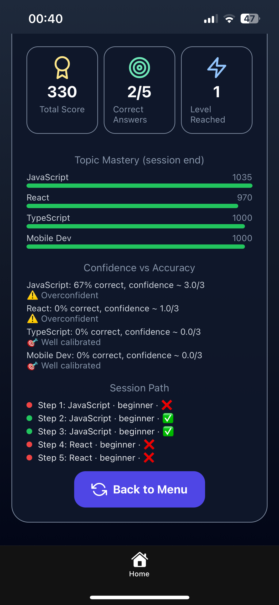

# Adaptive Boss Battle (React Native + Expo)

An adaptive, AI-inspired mobile learning game built with React Native and Expo.  
The game dynamically adjusts difficulty, tracks mastery, and evaluates users based on accuracy, confidence, and speed.

## Screenshots

### Setup Screen


## Live Demo
[Live Demo](https://akamazizi.github.io/Adaptive-Boss-Battle/)

### Gameplay


### Results



## Features

- Adaptive difficulty (beginner → intermediate → advanced)
- Mastery scoring with weak-area detection
- Confidence-based answering and speed bonuses
- Timer, streaks, and level progression
- Full session summary with analytics
- Clean mobile UI using Expo + NativeWind

## Tech Stack

- React Native (Expo)
- TypeScript
- NativeWind (Tailwind-style styling)
- Lucide Icons
- Optional: Claude API for adaptive question generation

## Getting Started

```bash
npm install
npx expo start

Open via Expo Go or any emulator.

## Purpose
This project demonstrates mobile UI/UX, adaptive learning mechanics, clean React Native architecture, and real-time game state logic.
Designed to showcase rapid product development and interactive learning design.

##License

MIT
```
